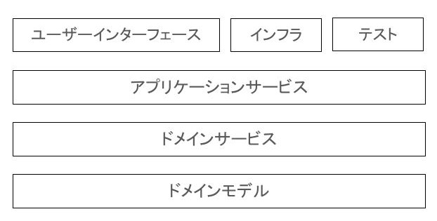

### 課題1-1
オニオンアーキテクチャを図解してください。その際、以下の概念を必ず含めてください。

- ドメインモデル
- ドメインサービス
- インフラ
- ユーザインターフェース

### 課題1-2
中心に位置するドメインモデル層は他のどの層にも依存していません。こうすることに、どのようなメリットがあるのでしょうか？
- 他の層の変更があった際、影響を受けにくくなる
- ドメインモデル層の変更が必要になった際は、他の層への影響を少なく変更できる

### 課題1-3
層をまたいで依存関係が発生する時（例えばユースケース層がレポジトリ層のメソッドを呼び出す時など）はインターフェースに対する依存のみ許可します。こうすることに、どのようなメリットがあるのでしょうか？
- テスト容易性が上がる
- 各層が疎結合になり、保守性が上がる

### 課題1-4
「依存性の逆転」がオニオンアーキテクチャにおいてどのように使われているのか説明してください*
- レイヤードアーキテクチャでは下位にあるインフラ層を、上位に持っていくとき
- 依存の方向を外側から内側にするとき

### 課題1-5
特定のユーザにしかリソースの追加や更新を許さないようなアクセス制限機能を実装したいとします。どの層に記述するのが適切でしょうか？（これは開発者によって意見が割れると思いますので、様々な観点から根拠を集めてみてください！）  
回答としては、2パターン考えている 
ドメイン層 
アプリケーション層 

ドメイン層としては、仕様として必ずチェックが入るルールなのであれば、こちらに書くべき 
アカウントに紐づくルールであればドメイン層に書く

アプリケーション層としては、ユースケースで変わるならこちらに書くべき

### 課題1-6
データベースをMySQLからPostgreSQLに変更するとします。どの層を変更する必要があるでしょうか？ 
インフラストラクチャ層