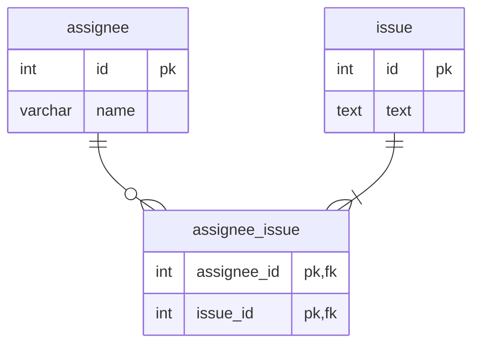

## データベースにおけるNULLの扱い

### 課題2-1
課題1の問題点を解決するよう、スキーマ設計を変更してみてください。

中間テーブルを持たせる設計にしました。  

果たしてNULLがデータベースに存在することは本当に悪いことなのでしょうか？
自分なりの意見を作って、トリオの方と議論してみてください。

必ずしも悪いことではないが、基本排除すべき。  
NULLを考慮してSQLを書かなければならなくなるので、余計な手間が増える。集計関数を扱うときもNULLを考慮したりするので、やはりない方がいい。  
以下のような場合は、NULLを許容してもいいのでは？と思ったりします。
- 会員登録が必要なサイトで、携帯電話と家庭電話の入力欄があるケース。家庭電話を持っていない人もいるので、そういう場合はNULLを許容してもいいのではと思う。
- 同じ会員登録でミドルネームの入力欄があるケース。

NULLを使用する場合は、アプリの設計段階でNULLの意味を明確にしておいた方がよいと思う。