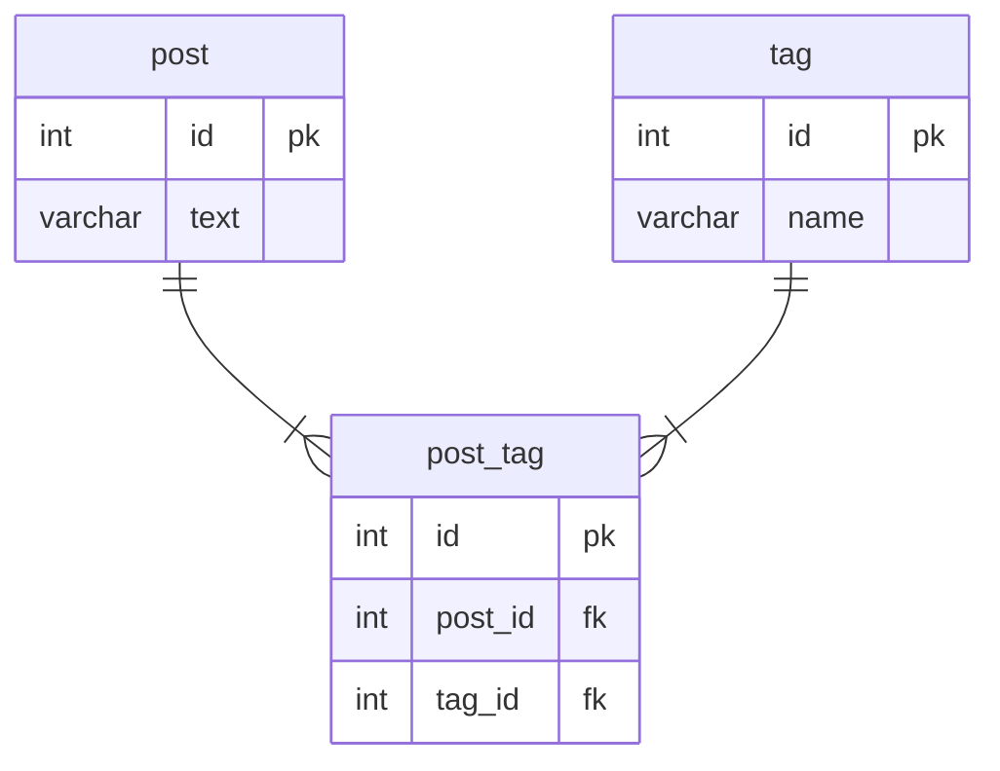

## データベース設計のアンチパターンを学ぶ2

### 課題2-1
課題1の問題点を解決するよう、スキーマ設計を変更してみてください。

```mermaid
erDiagram
post {
  int id pk
  varchar text
}

tag {
  int id pk
  varchar name 
}

post_tag {
  int id pk
  int post_id fk
  int tag_id fk
}


%% relations
post ||--|{ post_tag : ""
tag ||--|{ post_tag : ""
```