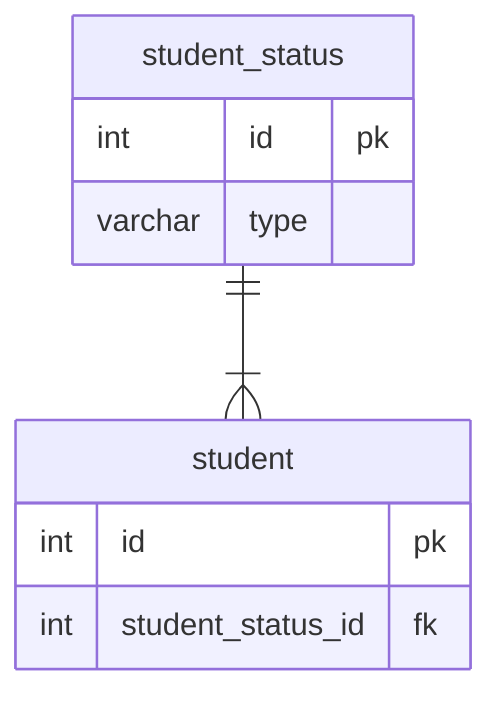

## データベース設計のアンチパターンを学ぶ6

### 課題2-1
課題1の問題点を解決するよう、スキーマ設計を変更してみてください。

```mermaid
erDiagram
student_status {
  int id pk
  varchar type
}

student {
  int id pk
  int student_status_id fk
}

%% relations
student_status ||--|{ student : ""
```