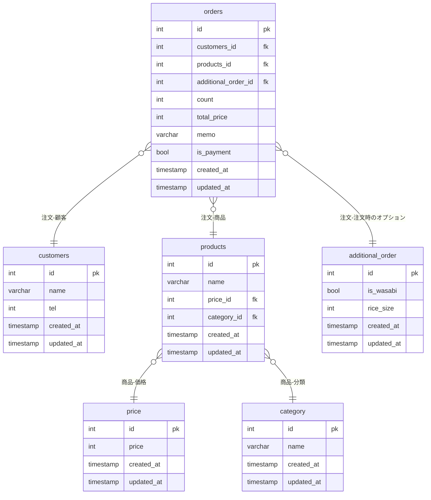

## ER図

```mermaid
erDiagram
customers {
  int id pk
  varchar name 
  int tel
  timestamp created_at
  timestamp updated_at
}

products {
  int id pk
  varchar name 
  int price_id  fk
  int category_id  fk
  timestamp created_at
  timestamp updated_at
}

price {
  int id pk
  int price 
  timestamp created_at
  timestamp updated_at
}

additional_order {
  int id  pk
  bool is_wasabi
  int rice_size
  timestamp created_at
  timestamp updated_at
}

orders {
  int id pk
  int customers_id fk
  int products_id fk
  int additional_order_id fk
  int count 
  int total_price 
  varchar memo 
  bool is_payment 
  timestamp created_at
  timestamp updated_at
}

category {
  int id pk
  varchar name
  timestamp created_at
  timestamp updated_at 
}

%% relations
products }o--|| price : "商品-価格"
products }o--|| category : "商品-分類"
orders }o--|| customers : "注文-顧客"
orders }o--|| additional_order : "注文-注文時のオプション"
orders }o--|| products : "注文-商品"
```

## 設計意図
今後注文のオプションが増える可能性があるので、注文のオプションテーブルを定義した