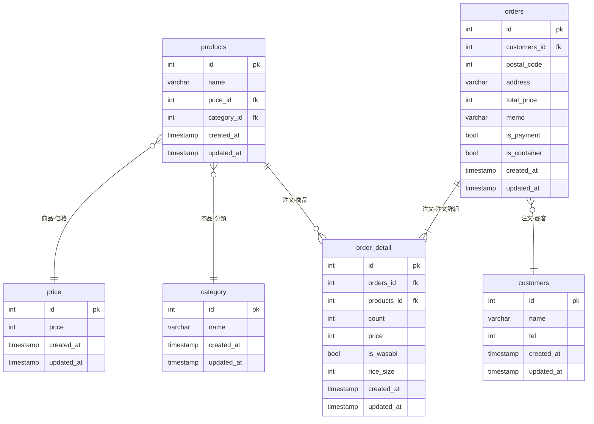

## ER図

#### 追加仕様
- 平日、休日で人気のメニューが知りたい
- お持ち帰りの際に、容器を使い捨てのものにするのか、箱に入れてもらうのか(ordersテーブルにis_containerを追加)
 
 

曜日ごとに注文数をカウント  
SELECT DAYNAME(order_detail.created_at) as weekday, SUM(order_detail.count) as "注文数" FROM products
JOIN order_detail ON products.id = order_detail.products_id
GROUP BY weekday
ORDER BY weekday DESC;

曜日と商品ごとに注文数をカウント  
SELECT DAYNAME(order_detail.created_at) as weekday, SUM(order_detail.count) as "注文数", products.name AS "商品名" FROM products
JOIN order_detail ON products.id = order_detail.products_id
GROUP BY weekday, products.name
ORDER BY weekday DESC;