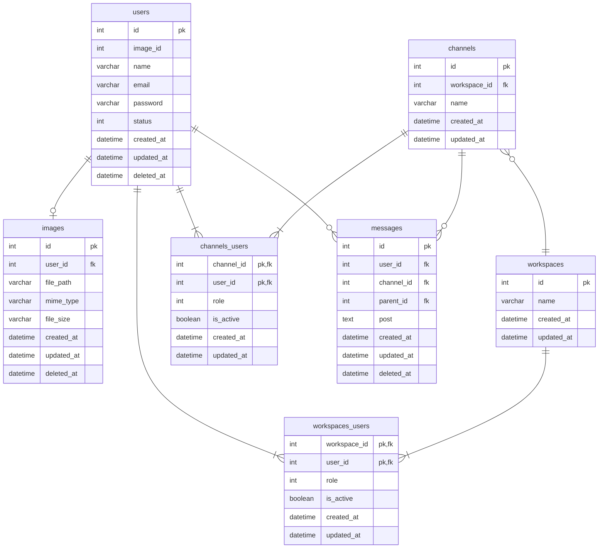

## データベースモデリング2 課題1

### PRの目的
DDL,DMLのレビューをお願いします。

### 結論
#### DDL,DML
課題1-1.sqlとユースケース.sqlをご参照ください。

#### ER図

### 考えたこと
- MTGの内容を踏まえて、usersテーブルとmessagesテーブルにdeleted_atを入れました。
- 検索機能にはFULLTEXT INDEXのngramを採用しました。(Mroongaを使おうと思ったら、外部キー制約があるテーブルには使えなさそうなので、断念しました。もし使える方法を知っている方がいれば教えていただきたいです。)

### 確認・相談したい内容
- 上記考えたことの検索機能のMroongaについて