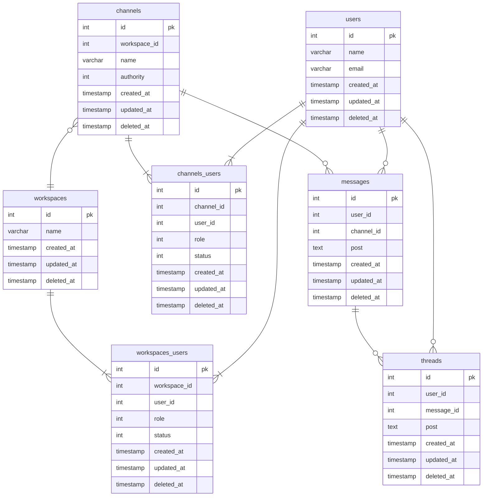

## データベースモデリング2 課題1

### PRの目的
論理設計したER図のレビューをお願いします。

### 結論
#### ER図

### 考えたこと
- ユーザーとワークスペース、ユーザーとチャンネル間の関係が多対多なので、中間テーブルを作成しました。
- ワークスペースとチャンネルには管理者が必要だと思うので、中間テーブルにroleカラムを追加
- statusカラムで参加・脱退の状態を表す

### 確認・相談したい内容
- 横断機能の実装が現時点で見当がついていない。ER図の中に組み込める？