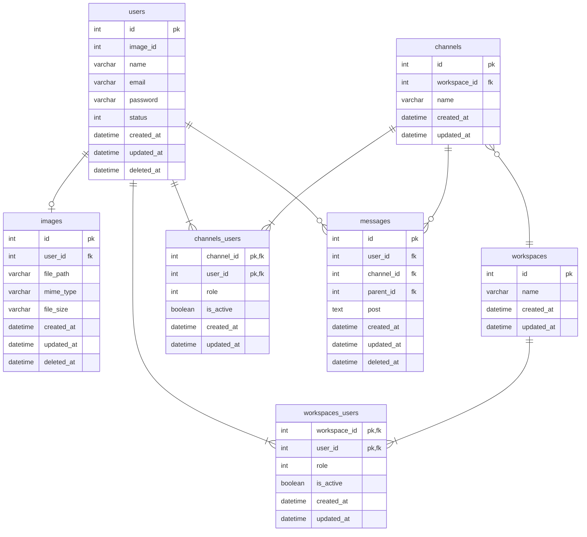

## データベースモデリング2 課題1

### PRの目的
論理設計したER図のレビューをお願いします。

### 結論
#### エンティティ
- ユーザー
  - 名前
  - メールアドレス
  - パスワード
  - ステータス(アクティブ、非アクティブ)
- 画像
  - ファイル名
  - ファイルパス
  - MIMEタイプ
  - ファイルサイズ
- ワークスペース
  - 名前
- チャンネル
  - 名前
- メッセージ
  - 投稿
- ワークスペースユーザー(中間テーブル)
  - 役割(管理者、メンバー)
  - ステータス(参加、脱退)
- チャンネルユーザー(中間テーブル)
  - 役割(管理者、メンバー)
  - ステータス(参加、脱退)

#### ER図

### 考えたこと
- ユーザーとワークスペース、ユーザーとチャンネル間の関係が多対多なので、中間テーブルを作成しました。
- ワークスペースとチャンネルには管理者が必要だと思うので、中間テーブルにroleカラムを追加
- statusカラムで参加・脱退の状態を表す
- メッセージテーブルはナイーブツリーで、スレッドを入れ子構造にしてみました。階層は2階層までと想定してテーブル設計をしました。(メッセージにスレッドで返信をする)

### 確認・相談したい内容
- 横断機能の実装は、アプリケーション側でするべき？？(statusカラムが有効ならば検索できるかを判定)
- メッセージの表示・非表示はアプリケーション側で制御？？(statusカラムが有効ならば表示する)
- 中間テーブルの命名規則について(https://qiita.com/tkawa/items/dc3e313021f32fd91ca6)