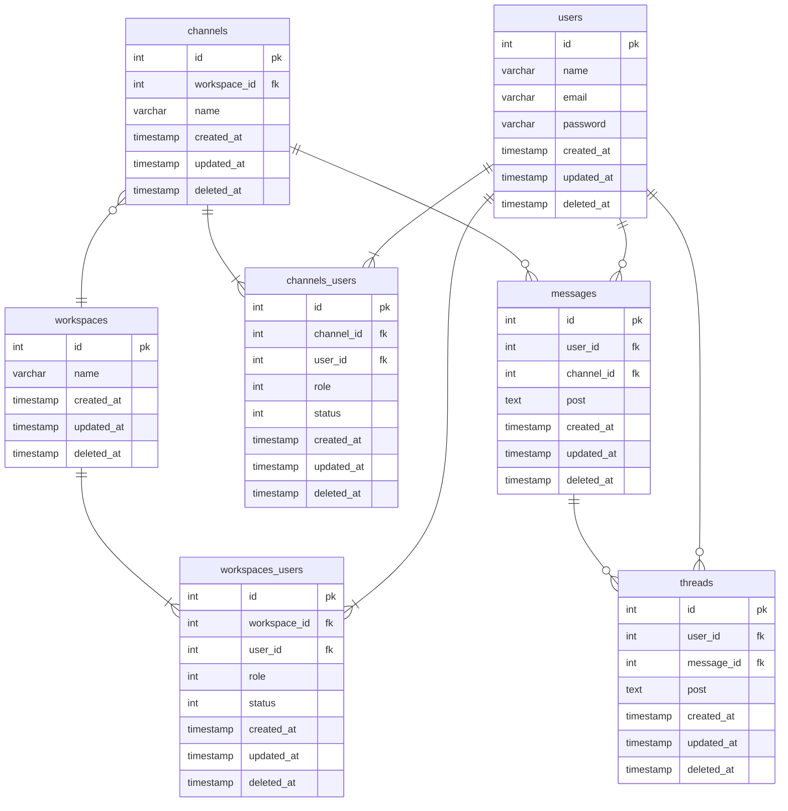

## データベースモデリング2 課題1

### PRの目的
論理設計したER図のレビューをお願いします。

### 結論
#### エンティティ
- ユーザー
  - 名前
  - メールアドレス
  - パスワード
- ワークスペース
  - 名前
- チャンネル
  - 名前
- メッセージ
  - 投稿
- スレッド
  - 投稿
- ワークスペースユーザー(中間テーブル)
  - 役割(管理者、メンバー)
  - 状態(参加、不参加)
- チャンネルユーザー(中間テーブル)
  - 役割(管理者、メンバー)
  - 状態(参加、不参加)

#### ER図

### 考えたこと
- ユーザーとワークスペース、ユーザーとチャンネル間の関係が多対多なので、中間テーブルを作成しました。
- ワークスペースとチャンネルには管理者が必要だと思うので、中間テーブルにroleカラムを追加
- statusカラムで参加・脱退の状態を表す

### 確認・相談したい内容
- 横断機能の実装が現時点で見当がついていない。ER図の中に組み込める？