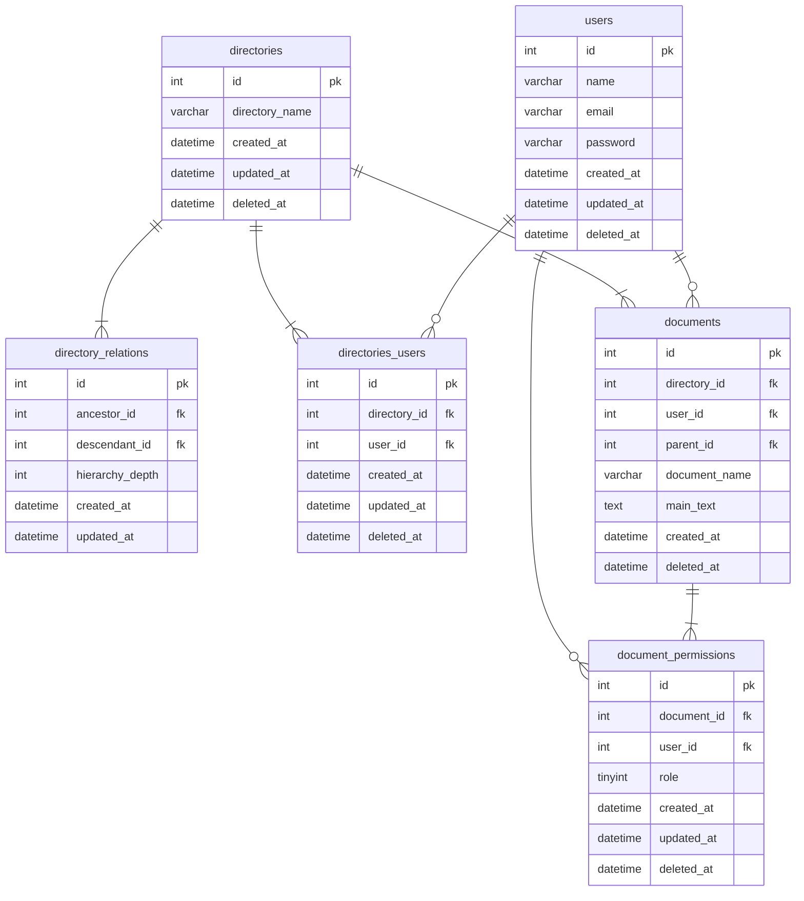

## データベースモデリング3 課題1

### PRの目的
論理設計、物理設計のレビューをお願いします。

### 結論
#### エンティティ
- ユーザー
  - 名前
  - メールアドレス
  - パスワード
- ディレクトリ
  - ディレクトリ名
- ドキュメント
  - ドキュメント名
  - 本文
- ドキュメント権限
  - 権限(作成編集、読み取り専用などを想定)

#### ER図

### 考えたこと
- ディレクトリ構造は閉包テーブルを採用しました。ディレクトリ構造が柔軟に変更することを考慮。
- ドキュメントは複数人が編集、閲覧できると考えて、多対多の構造にしました。document_permissionsテーブルで権限の管理を想定してます。
- documentsテーブルにparent_idを持たせて、履歴管理をできるようにしました。編集をする場合は、parent_idに主キーのidを入れていく。updated_atを廃止して、created_atで最新版を管理するイメージにしました。
- directories_usersテーブルは、アクセス権のあるユーザーを管理するテーブルです。
- 各テーブルに論理削除を採用する方向に変更しました。ドキュメントやディレクトリの復活時に、履歴を追いやすいと思ったからです。directory_relationsはディレクトリ構造が頻繁に変わることを考慮して、物理削除のままにしています。
- 階層はdirectory.pngを参照ください。

### 確認・相談したい内容
- 階層構造の実装方法(代表的なもので、経路列挙モデルなどがある)
- MTGを元に修正しました。気になる箇所あればご指摘いただきたいです！