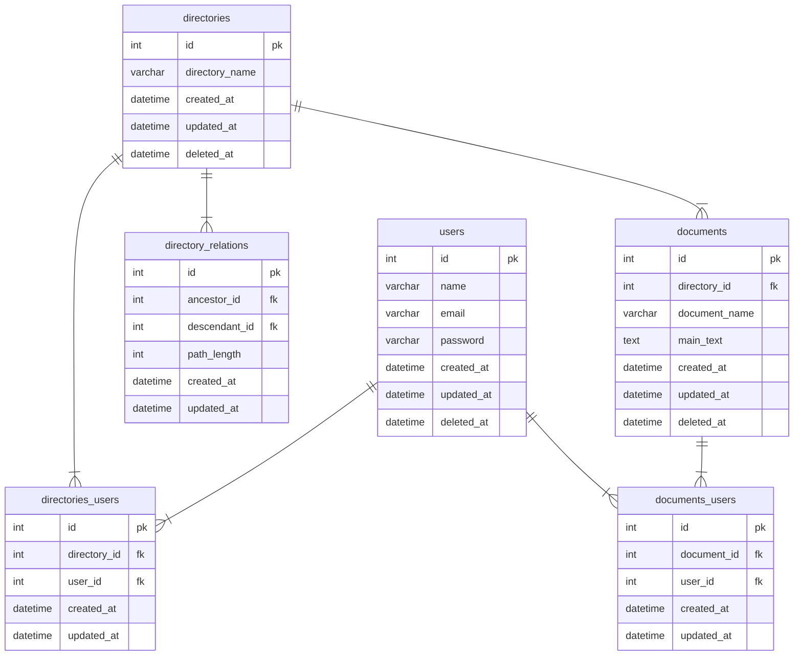

## データベースモデリング3 課題1

### PRの目的
論理設計、物理設計のレビューをお願いします。

### 結論
#### エンティティ
- ユーザー
  - 名前
  - メールアドレス
  - パスワード
- ディレクトリ
  - ディレクトリ名
- ドキュメント
  - ドキュメント名

#### ER図

### 考えたこと
- ディレクトリ構造は閉包テーブルを採用しました。ディレクトリ構造が柔軟に変更することを考慮。
- 論理削除は、ユーザー、ディレクトリ、ドキュメントに採用しました。ドキュメントのdirectory_idに外部キー制約をかけているので、ディレクトリも論理削除の方が履歴を追いやすいと考えました。
- 各関係を表すテーブル(directories_usersなど)は、履歴管理は不要と考えたので、物理削除にしました。
- 階層はdirectory.pngを参照ください。

### 確認・相談したい内容
- 階層構造の実装方法(代表的なもので、経路列挙モデルなどがある)