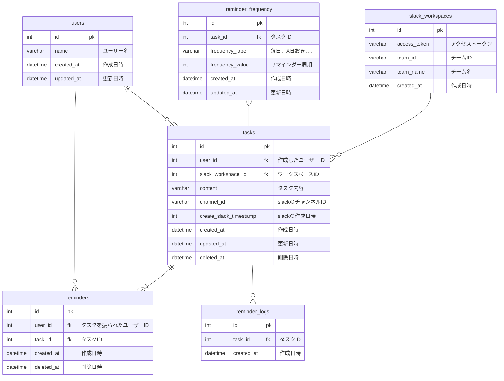

## データベースモデリング4 課題1

### PRの目的
論理設計、物理設計のレビューをお願いします。

### 結論
#### エンティティ
- ユーザー
- slackのワークスペース
- タスク
- リマインダー
- リマインダーの頻度
- リマインダーの実行履歴

#### ER図

### 考えたこと
- 複数の送信相手を設定できるが、文面は一緒の想定(Slackのメンション機能のような感じ)。
- リマインダー実行のログテーブルを作成して、履歴管理も考慮してみました。1時間ごとにバッチが動くので、その際に実行したリマインダーをログテーブルにインサートする想定です。
- データベースは、MariaDBを採用してみました。
- MTGをもとにテーブル設計をしてみました。

### 確認・相談したい内容
- タスクとリマインダーテーブルをまとめるいい方法があれば、ご教示いただきたいです。