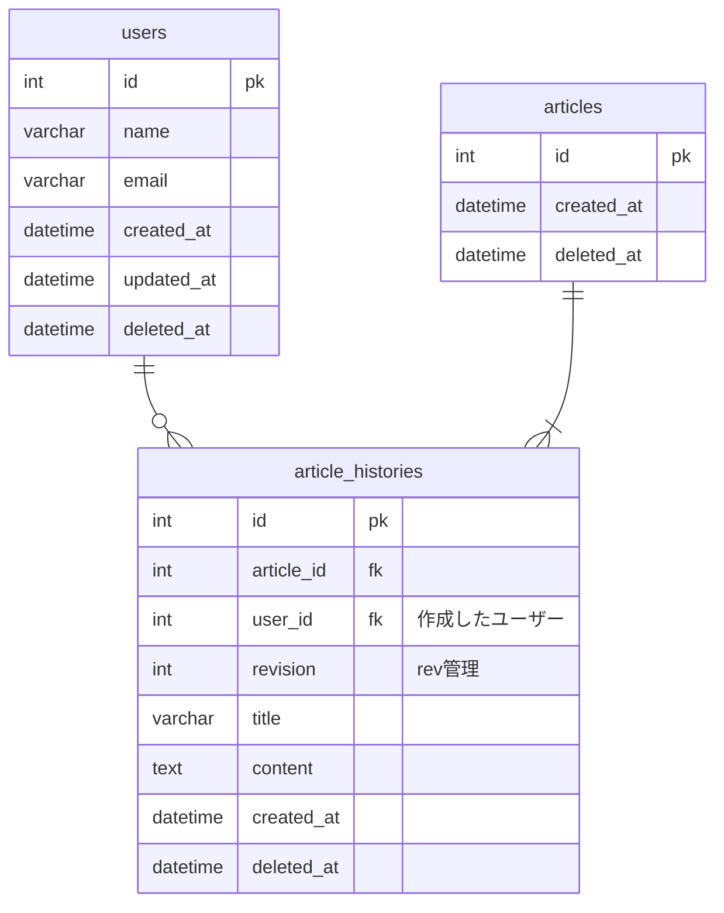

## データベースモデリング5 課題1

### PRの目的
論理設計、物理設計のレビューをお願いします。

### 結論
#### エンティティ
- ユーザー
- 記事
- 記事履歴

#### ER図

### 考えたこと
- articlesテーブルを親と考えて、記事が作成、更新されるたびに、article_idを外部キーにもったレコードを、article_historiesにINSERTしていく想定です。(UPDATEはしない)
- 記事の履歴はrevisionカラムで行う考えです。rev1から順に昇順していく。
- 履歴管理を考慮して、論理削除を用いています。articlesテーブルのdeleted_atに値が入った場合は、記事自体の削除を意味します。article_historiesのdeleted_atは最新revの管理に使用します。(article_idでソートして、deleted_atが入ってないものが最新版となる)

### 確認・相談したい内容
- article_historiesは物理削除でもいいかなと思ったのですが、過去の記事に戻した場合も履歴に残した方がいいと思って、論理削除にしました。ここの履歴管理をどうするべきか相談させていただきたいです。
(論理削除にした場合、rev管理がややこしくなりそう。rev3→2に戻して、rev2から更新する場合、それはrev4とすべき？)