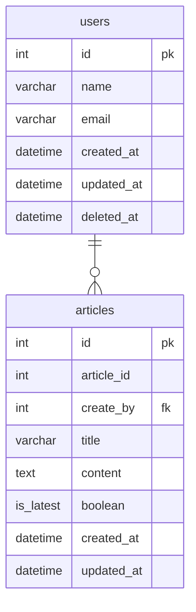

## データベースモデリング5 課題2

### PRの目的
課題2-1、2-2のレビューをお願いします。

### 課題2-1
##### 今回のようにアプリケーションに利用（履歴を一覧表示したり、履歴を復元）されるような履歴データはデータベースとして保存する必要がありますが、例えば「後から分析したいから履歴を残しておいて」など、分析のみの用途でも履歴データをデータベースに保存しておく必要はあるのでしょうか？ペアと話し合ってみてください。
データベースに保存しておく必要はあるのでしょうか？
→保存しておくべき。履歴データがないと、トラブルがあった時に追跡ができないと思う。ただし、必ずしもRDBである必要はないと考える。BigQueryなどのDWHに保存しておいても良さそう。
DWHのコスパ比較記事
https://www.acceluniverse.com/blog/developers/2024/10/redshift-bigquery-cost-performance.html

### 課題2-2
#### エンティティ
- ユーザー
- 記事

#### ER図

### 動作の想定
- 記事を新規作成する時には、statusカラムを最新にしてarticlesテーブルにINSERTする
- 更新する際は、statusが最新のものを過去にUPDATEして、編集した記事は、statusを最新にしてINSERTする
- 記事を削除したものは、statusを削除にする

### 考えたこと
- 課題1と同じような感じなのですが、記事テーブルを1つにまとめて、statusカラムで状態管理を考慮して実装しました。
- statusカラムの状態フラグを持たせるのは、若干のアンチパターンに該当するっぽい。ただ今回は、UNIQUE制約や他テーブルとJOINの可能性は少ないと考えて採用しました。

### MTG後の変更
- statusカラムでの状態管理を削除。is_latestカラムで、最新の記事を判断するようにしました。is_latestカラムが全てfalseとなった時にその記事は削除されたと判断します。

### 確認・相談したい内容
- 今回の設計で履歴管理をする上で、不整合ある箇所などありましたらご指摘いただきたいです。

### 参考文献
https://tech.buysell-technologies.com/entry/adventcalendar2022-12-16
https://qiita.com/n_yamadamadamada/items/e844d33db2fe47376c1f
https://qiita.com/Marusoccer/items/836bdc499623e9c71bc9
