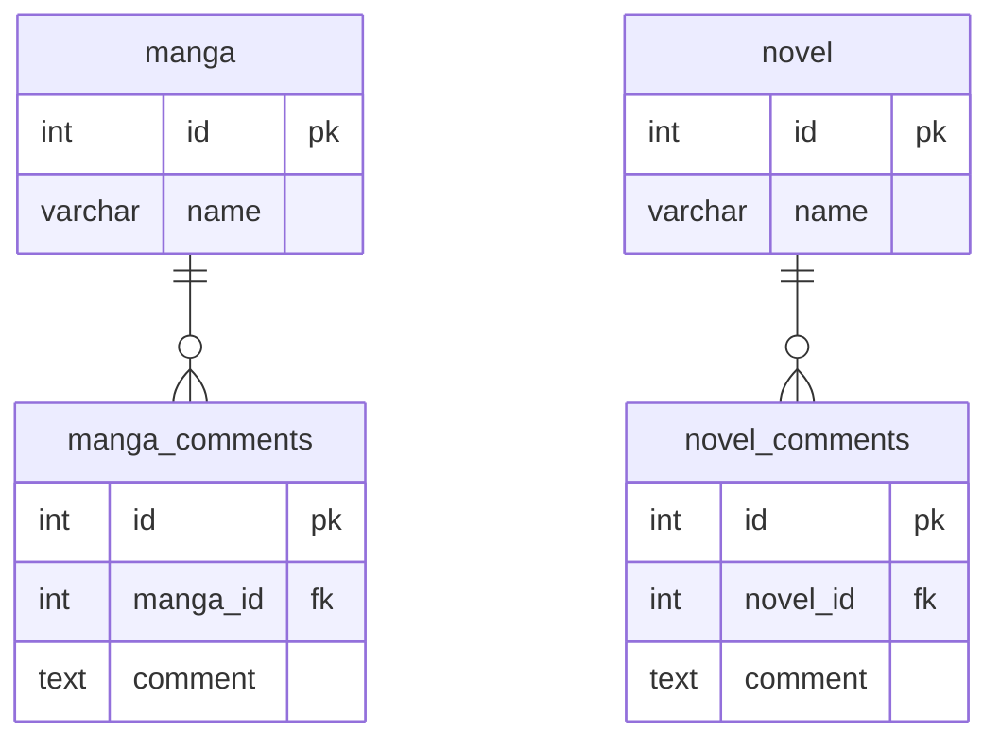

## データベース設計のアンチパターンを学ぶ3

### 課題2-1
課題1の問題点を解決するよう、スキーマ設計を変更してみてください。

それぞれCommentテーブルを持たせる設計にしました。

```mermaid
erDiagram
manga {
  int id pk
  varchar name
}

manga_comments {
  int id pk
  int manga_id fk
  text comment
}

novel {
  int id pk
  varchar name 
}

novel_comments {
  int id pk
  int novel_id fk
  text comment
}


%% relations
manga ||--o{ manga_comments : ""
novel ||--o{ novel_comments : ""
```

### 参考文献
https://spice-factory.co.jp/development/has-and-belongs-to-many-table/