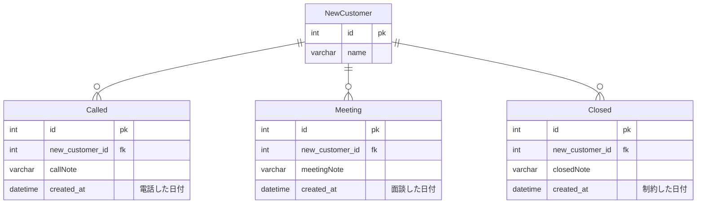

## データベース設計のアンチパターンを学ぶ5

### 課題2-1
課題1の問題点を解決するよう、スキーマ設計を変更してみてください。

```mermaid
erDiagram
NewCustomer {
  int id pk
  varchar name
}

Called {
  int id pk
  int new_customer_id fk
  varchar callNote
  datetime created_at "電話した日付"
}

Meeting {
  int id pk
  int new_customer_id fk
  varchar meetingNote
  datetime created_at "面談した日付"
}

Closed {
  int id pk
  int new_customer_id fk
  varchar closedNote
  datetime created_at "制約した日付"
}

%% relations
NewCustomer ||--o{ Called : ""
NewCustomer ||--o{ Meeting : ""
NewCustomer ||--o{ Closed : ""
```