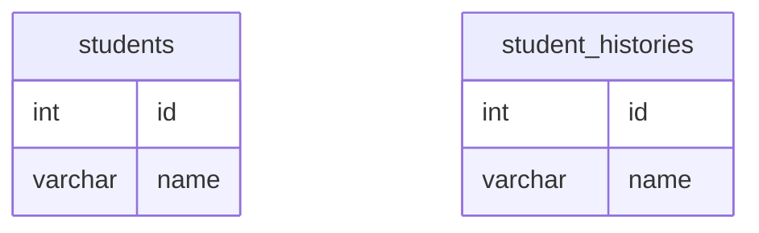
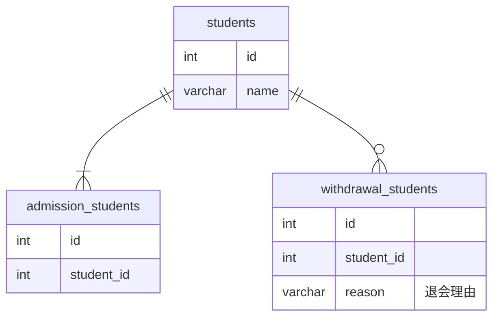

## データベース設計のアンチパターンを学ぶ7

### 課題2-1
課題1の問題点を解決するよう、スキーマ設計を変更してみてください。

#### 案1
テーブルを完全に分ける

```mermaid
erDiagram
students {
 int id
 varchar name
}

student_histories {
 int id
 varchar name
}
```

#### 案2
イベントごとに分ける

```mermaid
erDiagram
students {
 int id
 varchar name
}

admission_students {
 int id
 int student_id
}

withdrawal_students {
 int id
 int student_id
 varchar reason "退会理由"
}

%% relations
students ||--|{ admission_students : ""
students ||--o{ withdrawal_students : ""
```

案1の方が、検索処理や一覧表示は早いが、
イベントが増えた場合や、再入会のことを考えると、案2の方が良いかなと思ってます。