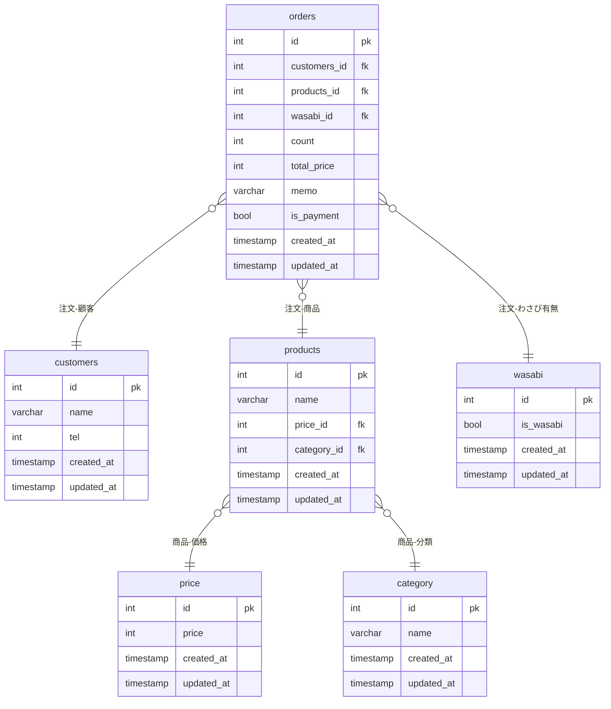

## ER図

### 論理モデル
物理層の制約にとらわれない。  
エンティティの抽出、各エンティティにどのようなデータ(属性)を保持するか決める。  
その際には、キーを明確化する。
正規化まで行い、ER図を作成する。  
データ・エンティティ、属性、キー及び関係を視覚化することが挙げられる。  
正規化、主キー、外部キーを明確化し、ER図を書く。
### 物理モデル
論理モデルのデータに対して、データ型を定義する。  
DBMS内部に格納するための「テーブル」の単位に変換をしていく。  
ハードウェア、ストレージのことも考慮する必要がある。