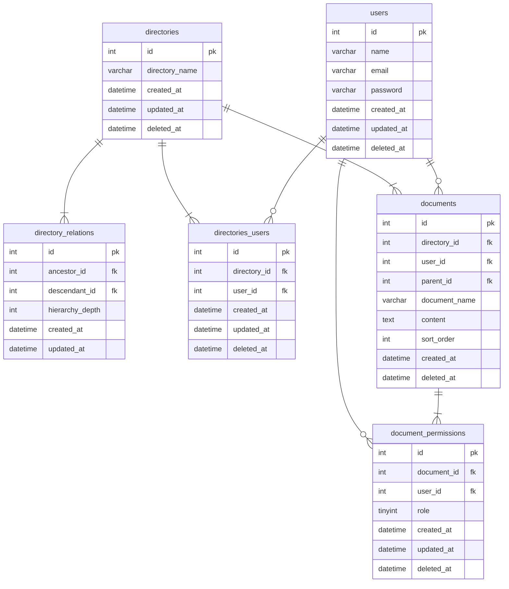

論理設計、物理設計のレビューをお願いします。

### 結論
#### ER図
- ※課題1でdocumentsテーブルの設計を変更しました。

### 考えたこと
- documentsテーブルに並び順を格納するカラム(sort_order)を追加しました。

### 確認・相談したい内容
- 自分が実装した以外の並び替え方法があれば、ご教示いただきたいです。
- 補足資料の案2も検討しましたが、SQLで並び替えを考慮しての取得方法が思いつかなかったので、今回の並び順カラムを採用しました。

### 補足資料
https://zenn.dev/hamchance/scraps/04a20026a423c0